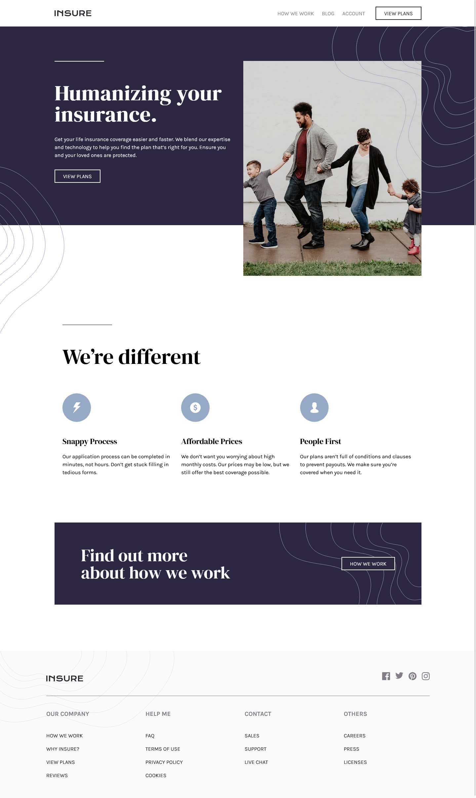

# Frontend Mentor - Insure landing page solution

This is a solution to the
[Insure landing page challenge on Frontend Mentor](https://www.frontendmentor.io/challenges/insure-landing-page-uTU68JV8).
Frontend Mentor challenges help you improve your coding skills by building realistic projects.

## Table of contents

-   [Overview](#overview)
    -   [The challenge](#the-challenge)
    -   [Screenshot](#screenshot)
    -   [Links](#links)
-   [My process](#my-process)
    -   [Built with](#built-with)
    -   [What I learned](#what-i-learned)
    -   [Continued development](#continued-development)
-   [Author](#author)

## Overview

### The challenge

Users should be able to:

-   View the optimal layout for the site depending on their device's screen size
-   See hover states for all interactive elements on the page

### Screenshot

### Links

-   [Solution URL:](https://github.com/c0dehamster/insure-landing-page)
-   [Live Site URL:](https://c0dehamster.github.io/insure-landing-page/)

## My process

### Built with

-   Semantic HTML5 markup
-   CSS custom properties
-   Flexbox
-   CSS Grid
-   Mobile-first workflow
-   BEM naming convention

### What I learned

I used this project as an opportunity to learn more about accessibility best practices. This turned out to be a rather
complex topic in case of some parts of the page such as the drop-down navigation, the list of links to social media, the
extended navigation in the footer. There are likely still things to be improved.

The project required to use multiple pseudo-elements for various decorative elements. These were fun to move around to
achieve the desired configuration of background images and borders.

### Continued development

I am planning to do more "realistic" projects like this to practice my layout skills.

## Author

-   Frontend Mentor - [@twDevNoob](https://www.frontendmentor.io/profile/twDevNoob)
